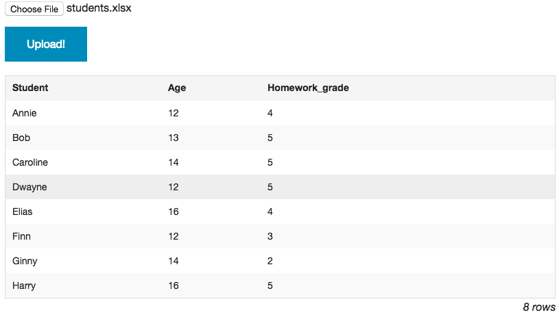
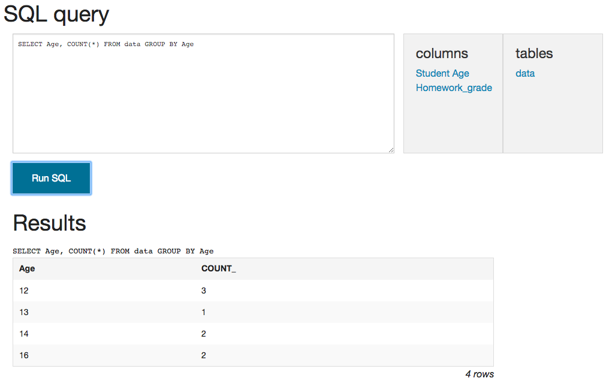

# xls_sql

A simple page to analyze excel files using SQL syntax. Of course, you can do a lot with COUNTIF(), pivot tables, and other excel functions but I find that SQL syntax is often simpler.

Hosted at [xls-sql.herokuapp.com](https://xls-sql.herokuapp.com/)

In brief, you can import data...

...and then use SQL syntax to analyze it...

The first row is interpreted to be the column names.

# Dependencies

Flask: `easy_install Flask`
xlrd: `easy_install xlrd`

# Usage

`python app.py`

# TODOs

- better error handling on import, like detecting when there isn't a heading row.
- possibly allow editing the heading row and the auto-detected types
- drag+drop to upload
- upload multiple sheets and then allow running joins between them!
- "edit" button on results to populate query and re-run it
- "download" button on results to download (as xlsx or csv)
- ability to sort by column headers
- ability to filter by column headers
- ability to "pop out" and "pop in" large sheets
- much better UI / look and feel
- populate the database using a webworker
- structured query input? Can autocomplete column and table names, highlight syntax errors, etc.
- client-side csv parsing (should be easy)
- client-side xlsx parsing (possibly through emscripten)? it would be nice to get rid of the server entirely.
- deploy to Heroku
